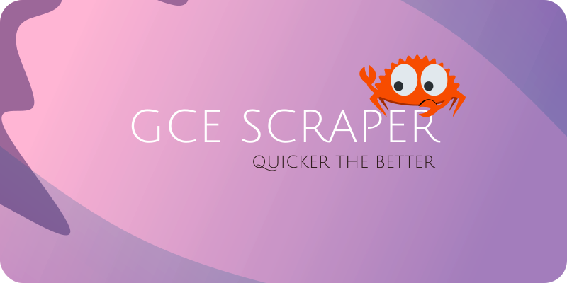

<p align="center">
	
</p>
<h1 align="center">GCE Scraper</h1>
<p align="center">
	<em>Download past papers, faster.
</em>
</p>
<p align="center">
	<!-- local repository, no metadata badges. --></p>
<p align="center">Built with the tools and technologies:</p>
<p align="center">
	
	
</p>
<br>

## 🔗 Table of Contents

- [📍 Overview](#-overview)
- [👾 Features](#-features)
- [📁 Project Structure](#-project-structure)
  - [📂 Project Index](#-project-index)
- [🚀 Getting Started](#-getting-started)
  - [☑️ Prerequisites](#-prerequisites)
  - [⚙️ Installation](#-installation)
  - [🤖 Usage](#🤖-usage)
  - [🧪 Testing](#🧪-testing)
- [📌 Project Roadmap](#-project-roadmap)
- [🔰 Contributing](#-contributing)
- [🎗 License](#-license)
- [🙌 Acknowledgments](#-acknowledgments)

---

## 📍 Overview

`gce-scraper` efficiently downloads past GCE exam papers.  Users specify subjects, years, and paper types, and the tool uses multi-threading to quickly acquire and save them.  This saves students and educators significant time and effort in accessing vital study materials.

---

## 👾 Features

|      | Feature         | Summary       |
| :--- | :---:           | :---          |
| ⚙️  | **Architecture**  | <ul><li>The project uses a modular architecture, with distinct modules for configuration generation (`config_gen.rs`), configuration management (`configuration.rs`), web scraping (`scraper.rs`), and downloading (`download.rs`).</li><li>The main application logic resides in `src/main.rs`, orchestrating the interaction between these modules.</li><li>It leverages a `<Cargo>`-based build system, indicating a well-structured Rust project.</li><li>The application uses a configuration file (likely TOML) to manage settings, promoting flexibility and maintainability.  See `src/configuration.rs` and `Cargo.toml`.</li></ul> |
| 🔩 | **Code Quality**  | <ul><li>The codebase is written in `<Rust>`, known for its focus on memory safety and performance.</li><li>The use of established crates like `<clap>` for command-line argument parsing and `<log>` for logging suggests a focus on best practices.</li><li>Further analysis of the code would be needed to assess aspects like code style consistency and adherence to coding standards.</li><li>The modular design promotes code reusability and maintainability.</li></ul> |
| 📄 | **Documentation** | <ul><li>The project includes a `Cargo.toml` file and several `.rs` files (6, according to the provided context).  See `FILE CONTENTS`.</li><li>The primary language is `<Rust>`, and the documentation appears to be primarily embedded within the code itself and the `Cargo.toml` file.</li><li>The provided context suggests that the documentation could be improved by adding more detailed comments and potentially external documentation.</li><li>Install, usage, and test commands are provided, indicating some level of documentation for execution.</li></ul> |
| 🔌 | **Integrations**  | <ul><li>The project uses `<reqwest>` for making HTTP requests to scrape data from a website.</li><li>It leverages `<tokio>` for asynchronous operations, likely improving performance, especially during web scraping and downloading.</li><li>`<serde>` is used for serialization, likely for handling the configuration file and potentially the scraped data.</li><li>The `<clap>` crate handles command-line argument parsing, providing a user-friendly interface.</li></ul> |
| 🧩 | **Modularity**    | <ul><li>The codebase is divided into several modules (`config_gen.rs`, `configuration.rs`, `scraper.rs`, `download.rs`, `lib.rs`), promoting code organization and reusability.</li><li>The `lib.rs` file acts as a central point for exposing these modules, further enhancing modularity.</li><li>This modular design improves maintainability and allows for easier testing of individual components.</li><li>Dependencies are managed effectively using `<Cargo>`, further supporting modularity.</li></ul> |

---

## 📁 Project Structure

```sh
└── /
    ├── Cargo.lock
    ├── Cargo.toml
    └── src
        ├── config_gen.rs
        ├── configuration.rs
        ├── download.rs
        ├── lib.rs
        ├── main.rs
        └── scraper.rs
```


### 📂 Project Index
<details open>
	<summary><b><code>/</code></b></summary>
	<details> <!-- __root__ Submodule -->
		<summary><b>__root__</b></summary>
		<blockquote>
			<table>
			<tr>
				<td><b><a href='/Cargo.toml'>Cargo.toml</a></b></td>
				<td>- `gce-scraper` defines a Rust project using various crates for command-line argument parsing, logging, HTTP requests, and parallel processing<br>- It leverages `reqwest` for web scraping, `clap` for user interface, and `par-stream` for concurrent operations<br>- The project's core functionality centers on data scraping and likely involves processing the acquired data using `serde` for serialization.</td>
			</tr>
			</table>
		</blockquote>
	</details>
	<details> <!-- src Submodule -->
		<summary><b>src</b></summary>
		<blockquote>
			<table>
			<tr>
				<td><b><a href='/src/main.rs'>main.rs</a></b></td>
				<td>- The `src/main.rs` file serves as the main entry point, orchestrating the GCE-Guide past paper scraper<br>- It parses command-line arguments to either generate a configuration file specifying download parameters (papers, years, subjects, seasons) or download past papers using a provided configuration<br>- The program utilizes multi-threading for efficient I/O operations, managing logging verbosity based on user input.</td>
			</tr>
			<tr>
				<td><b><a href='/src/config_gen.rs'>config_gen.rs</a></b></td>
				<td>- `config_gen.rs` generates a TOML configuration file<br>- It retrieves syllabus information,  paper details across specified years and seasons,  and  consolidates this data<br>- The resulting configuration file, written to the designated output path,  is used by other parts of the application to manage and process academic papers, leveraging multi-threading for efficient data retrieval.</td>
			</tr>
			<tr>
				<td><b><a href='/src/configuration.rs'>configuration.rs</a></b></td>
				<td>- The `src/configuration.rs` file defines a `Configuration` struct and implements its loading from a TOML configuration file<br>- This struct, used throughout the application (as indicated by its `pub` visibility),  holds application-wide settings, specifically details about papers (`PaperType`) and subject-year configurations (`YearConfiguration`)<br>- It acts as a central point for managing the application's configurable parameters.</td>
			</tr>
			<tr>
				<td><b><a href='/src/scraper.rs'>scraper.rs</a></b></td>
				<td>- The `scraper.rs` module facilitates web scraping of examination papers from a specific website<br>- It retrieves available years and papers based on syllabus codes,  paper types, and seasons<br>- The module then downloads and saves the requested papers to specified file paths<br>- Error handling is implemented to manage network and parsing issues, ensuring robust data acquisition.</td>
			</tr>
			<tr>
				<td><b><a href='/src/download.rs'>download.rs</a></b></td>
				<td>- `download.rs` manages the downloading and saving of academic papers<br>- It reads configuration data, creates necessary directories, and then concurrently downloads papers for specified subjects and years, leveraging multiple threads for efficiency<br>- The module handles potential errors during configuration parsing and file system operations, ensuring robust download management within the larger application.</td>
			</tr>
			<tr>
				<td><b><a href='/src/lib.rs'>lib.rs</a></b></td>
				<td>- `src/lib.rs` establishes the core library for the project, providing foundational modules<br>- It initializes logging and exposes modules responsible for configuration management (`config_gen`, `configuration`), web scraping (`scraper`), and data downloading (`download`)<br>- These modules collectively form the building blocks for the application's primary functionality.</td>
			</tr>
			</table>
		</blockquote>
	</details>
</details>

---
## 🚀 Getting Started

### ☑️ Prerequisites

Before getting started with , ensure your runtime environment meets the following requirements:

- **Programming Language:** Rust
- **Package Manager:** Cargo


### ⚙️ Installation

Install  using one of the following methods:

**Build from source:**

1. Clone the  repository:
```sh
❯ git clone https://github.com/NightSling/GCE-Scraper.git
```

2. Navigate to the project directory:
```sh
❯ cd GCE-Scraper
```

3. Install the project dependencies:


**Using `cargo`** &nbsp; [](https://www.rust-lang.org/)

```sh
❯ cargo build
```


### 🤖 Usage
Run  using the following command:
**Using `cargo`** &nbsp; [](https://www.rust-lang.org/)

```sh
❯ cargo run -- --help
```


### 🧪 Testing
Run the test suite using the following command:
**Using `cargo`** &nbsp; [](https://www.rust-lang.org/)

```sh
❯ cargo test
```


---
## 📌 Project Roadmap

- [X] **`Task 1`**: <strike>Parallel config generation.</strike>
- [X] **`Task 2`**: <strike>Parallel downloading based on config.</strike>
- [ ] **`Task 3`**: Extend the use cases to other miscellaneous files such as specimen papers and such.
- [ ] **`Task 4`**: Extend the limitation from A-Levels to other boards supported by GCE Guide.

---

## 🔰 Contributing

- **💬 [Join the Discussions](https://LOCAL///discussions)**: Share your insights, provide feedback, or ask questions.
- **🐛 [Report Issues](https://LOCAL///issues)**: Submit bugs found or log feature requests for the `` project.
- **💡 [Submit Pull Requests](https://LOCAL///blob/main/CONTRIBUTING.md)**: Review open PRs, and submit your own PRs.

<details closed>
<summary>Contributing Guidelines</summary>

1. **Fork the Repository**: Start by forking the project repository to your LOCAL account.
2. **Clone Locally**: Clone the forked repository to your local machine using a git client.
   ```sh
   git clone .
   ```
3. **Create a New Branch**: Always work on a new branch, giving it a descriptive name.
   ```sh
   git checkout -b new-feature-x
   ```
4. **Make Your Changes**: Develop and test your changes locally.
5. **Commit Your Changes**: Commit with a clear message describing your updates.
   ```sh
   git commit -m 'Implemented new feature x.'
   ```
6. **Push to LOCAL**: Push the changes to your forked repository.
   ```sh
   git push origin new-feature-x
   ```
7. **Submit a Pull Request**: Create a PR against the original project repository. Clearly describe the changes and their motivations.
8. **Review**: Once your PR is reviewed and approved, it will be merged into the main branch. Congratulations on your contribution!
</details>

<details closed>
<summary>Contributor Graph</summary>
<br>
<p align="left">
   <a href="https://github.com/NightSling/GCE-Scraper/graphs/contributors">
      
   </a>
</p>
</details>

---

## 🎗 License

This project is protected under the [Apache Version 2.0](https://www.apache.org/licenses/LICENSE-2.0.txt) License. For more details, refer to the [LICENSE](LICENSE.txt) file.

---

## 🙌 Acknowledgments
- Access all past papers easily through [GCE-Guide](https://papers.gceguide.cc/a-levels/). All papers are the property of Cambridge Assessment International Education (CAIE). The purpose of the software is not to promote piracy or the sharing of proprietary content, but rather to serve as an educational tool.
- The README.md is generated through [readme-ai](https://github.com/eli64s/readme-ai).

---
